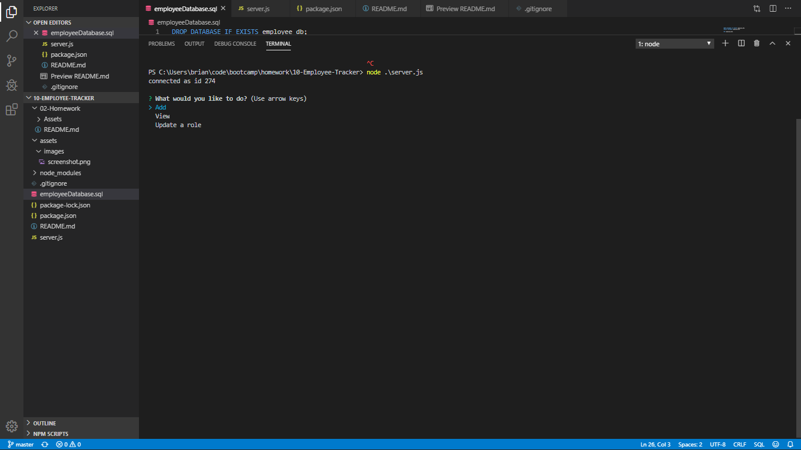

# 10-Employee-Tracker
View, add to, and update a database containing information on departments, roles, and employees.

### Table of Contents
- [Description](#Description)
- [Concepts](#Concepts)
- [Technologies](#Technologies)
- [Lanuages-Used](#Languages-Used)
- [Link](#Link)

### Description

Using CRUD methods in the back-end to create, view, and update data from a database using SQL.

### Screenshot

### Concepts

- #### CRUD

- #### Back-End SQL Database

- #### Node Modules

- #### NPM (Node Package Manager)

- #### Express Servers

- #### MySQL

### Technologies

- [Bootstrap](https://getbootstrap.com/) - CSS Framework
- [NPM](https://www.npmjs.com/) - NPM
- [Express](https://www.npmjs.com/package/express) - Express
- [MySQL] - MySQL

### Languages Used

- JavaScript
- SQL

### Link

Github page

https://github.com/astrobeef/10-Employee-Tracker

